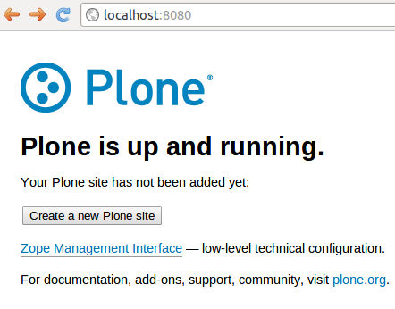
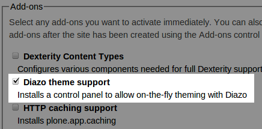
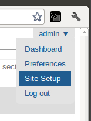

=============================================================
Theming with plone.app.theming
============================================================

.. admonition:: Description

   This tutorial is meant for those who like a quickstart to theming a Plone website

.. contents:: :local:

Introduction
============
With the introduction of Diazo (plone.app.theming), it is now easier then ever to create a whole new look and feel for a Plone site. Where before one needed a medium level of knowledge of the Plone eco-system, it is now possible to use any html-template and lay it upon a Plone website. 

QuickStart
==========
* Download and install the latest plone version from <http://www.plone.org/>
* Create a Plone site

You will be asked for for a username and password. These are set in the file buildout.cfg and is default 'admin' 'admin'. Make sure to set a safe password before deploying.

* Install the theming-engine
Make sure to check 'Diazo theme support' in the Add-ons section

If you forgot this last step, or want to activate it later, go to the 'admin'-section in the top-right, select 'site-setup', then 'Add-ons'. There you can install the theming-engine anytime.

Activating the theming engine
-----------------------------

Basics of plone.app.theming
---------------------------

